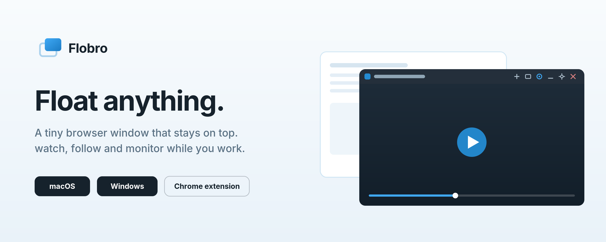

  

# Flobro Chrome Extension

The browser companion of the [Flobro desktop app](https://flobro.app), and the modern successor of the original [Flobro Chrome App](https://github.com/flobro/flobro-chrome-app). It pops any tab, link or video out into a minimal popup window, and forwards pages to the desktop app for true always-on-top floating.

## Features

- **Toolbar popup** with two actions:
  - *Float in a popup window*: moves the tab into a chromeless popup, playback keeps running
  - *Open in Flobro desktop app*: hands the page to the app via the `flobro://` link. The first time, the popup asks whether the app opened and remembers the answer; without the app installed, the button takes you to flobro.app instead of doing nothing.
- **Right-click menu**: Float this page / link / video, plus "Open in Flobro app"
- **Options**: default window size, move-vs-copy behavior, analytics opt-out, detection reset
- **Languages**: English and Dutch, auto-selected by the browser

## Analytics

Same privacy-friendly setup as the desktop app: PostHog EU, hostname-only (`youtube.com`, never full URLs), no IP storage, random anonymous id, opt-out in the options. Nothing is sent until `FLOBRO_PH_KEY` in `shared.js` holds a real key. See the [privacy page](https://flobro.app/privacy.html).

## Install for development

1. Open `chrome://extensions`
2. Enable Developer mode
3. "Load unpacked" and select this folder

## Publish

Zip this folder and upload via the [Chrome Web Store developer dashboard](https://chrome.google.com/webstore/devconsole). Disclose the analytics (hostname-only, opt-out) in the privacy tab of the listing.

## License

MIT
